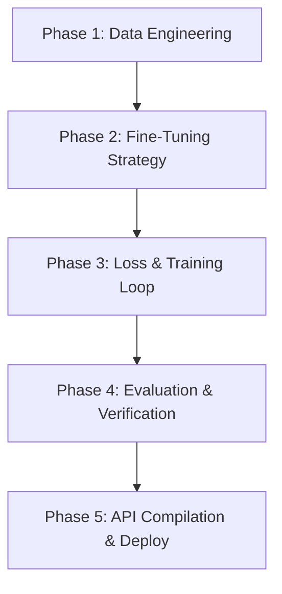

# Development Plan: Fine-Tuning TiRex-2 into ForecastAgent 1.0

This document outlines the strategic engineering roadmap to adapt, fine-tune, and optimize the pre-trained **TiRex-2** time series foundation model (NX-AI/TiRex-2) into a production-ready, domain-specialized **ForecastAgent 1.0** model.

---

## 1. Executive Summary
The goal is to transition from zero-shot forecasting to a specialized, high-accuracy enterprise model (**ForecastAgent 1.0**). Since the TiRex-2 model has a small active parameter footprint (~38.4M parameters for univariate and ~82.5M for multivariate), it is highly responsive to fine-tuning on domain-specific datasets (e.g., electricity load patterns, retail sales, supply chain demand) without requiring massive GPU clusters.

We propose a phased approach combining **Supervised Fine-Tuning (SFT)** using a multi-quantile pinball loss function, **Parameter-Efficient Fine-Tuning (PEFT/LoRA)** to preserve foundation generalization, and a robust **validation framework** to measure improvements.

---

## 2. Core Architecture Analysis
Before fine-tuning, we must analyze the key components of the `TiRex-2` architecture:
*   **Patch Embedding Layer**: Converts raw univariate/multivariate time series inputs into patch tokens (handling context length projection).
*   **Backbone (xLSTM / Transformer)**: The sequence modeling layers that learn temporal and cross-variate dependencies.
*   **Probabilistic Projection Head**: Generates 9 distinct quantile projections (`[0.1, 0.2, 0.3, 0.4, 0.5, 0.6, 0.7, 0.8, 0.9]`) to represent prediction intervals.

### Fine-Tuning Paradigms:
1.  **PEFT (LoRA)**: Freeze the backbone and insert low-rank adapter matrices (rank $r=8$ or $16$) into the query/key/value projections of the attention blocks or xLSTM gate projections. This is the recommended route to prevent catastrophic forgetting.
2.  **Head-Only Tuning**: Freeze the patch embedding and backbone, training only the quantile regression projection head on target downstream data.
3.  **Full Fine-Tuning**: Train all parameters end-to-end with a low learning rate ($1e-5$) and linear warmup scheduler, suitable when target domain data is highly abundant.

---

## 3. Detailed Phase Breakdown



### Phase 1: Data Engineering & Pipeline Setup
*   **Data Preparation**: Format historical time series into overlapping windows of size $C$ (context window) and targets of size $H$ (prediction horizon).
*   **Covariate Alignment**: Format past covariates (e.g., historical pricing) and future-known covariates (e.g., holidays, promotional schedules) matching the `TimeseriesType` requirements.
*   **Normalization**: Standardize each time series window using instance normalization (zero-mean, unit-variance) to stabilize training, matching TiRex-2's internal config.

### Phase 2: PEFT/LoRA Configuration
Using `peft` or a custom parameter injector:
*   Target modules: Attention projection matrices (`q_proj`, `v_proj`) or xLSTM kernel weights.
*   Configure $r = 16$, $\alpha = 32$, and dropout = 0.05.
*   Preserve the pre-trained weights to maintain zero-shot capabilities on unrelated datasets.

### Phase 3: Training Objective (Quantile Pinball Loss)
Since ForecastAgent 1.0 must output robust probabilistic predictions, we train using **Quantile (Pinball) Loss** summed over the target quantiles:

$$\mathcal{L}_{pinball}(y, \hat{y}) = \frac{1}{Q} \sum_{q \in Q} \max\left(q(y - \hat{y}_q), (q - 1)(y - \hat{y}_q)\right)$$

Where $Q = [0.1, 0.2, 0.3, 0.4, 0.5, 0.6, 0.7, 0.8, 0.9]$.
*   **Optimization**: AdamW optimizer.
*   **Learning Rate**: $5\times10^{-5}$ with Cosine Annealing learning rate scheduler.
*   **Batch Size**: 64 series windows.

### Phase 4: Evaluation & Validation Framework
To verify that ForecastAgent 1.0 outperforms the base TiRex-2 model:
*   **Metrics**: Track MAPE, sMAPE, RMSE, and **Interval Coverage Probability (ICP)** to ensure the 90% confidence intervals are well-calibrated.
*   **Split**: 70% Train, 15% Validation, 15% Out-of-sample Test.
*   **Data Leakage Check**: Ensure no temporal overlap between the training windows and the test windows.

### Phase 5: Production API Compilation & Deployment
*   Serialize the fine-tuned adapter weights.
*   Update `api_server.py` to load the base model and dynamically merge the adapter weights at boot time:
    ```python
    model = load_model("NX-AI/TiRex-2", device="cpu")
    model.load_adapter("path/to/forecastagent-v1-lora")
    ```
*   Serve forecasts through the `POST /v1/predict` endpoint.

---

## 4. Timeline and Milestones

| Milestone | Duration | Key Deliverable |
| :--- | :--- | :--- |
| **M1: Data Pipeline** | 1 Week | Automated dataset windowing and covariate loaders |
| **M2: LoRA Setup** | 1 Week | PyTorch training script with adapter injection |
| **M3: Model Training** | 2 Weeks | Completed fine-tuning runs on GPU cluster (or CPU test) |
| **M4: Evaluation** | 1 Week | Validation reports showing MAPE improvement vs TiRex-2 |
| **M5: Deployment** | 1 Week | API server update with merged adapter weights |
